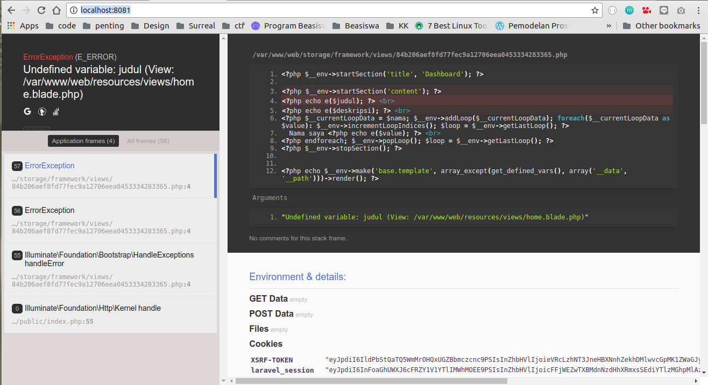

## Dokumentasi Soal 3
# Provisioning Install PHP, MySQL, Composer, dan Nginx di Vagrant Virtualbox 

## Soal
Buat vagrant virtualbox dan lakukan provisioning install:

* php 
* mysql
* composer
* nginx

Setelah melakukan provisioning, clone https://github.com/fathoniadi/pelatihan-laravel.git pada folder yang sama dengan vagrantfile di komputer host. Setelah itu sinkronisasi folder pelatihan-laravel host ke vagrant ke /var/www/web dan jangan lupa install vendor laravel agar dapat dijalankan. Setelah itu setting root document nginx ke /var/www/web. webserver VM harus dapat diakses pada port 8080 komputer host dan mysql pada vm dapat diakses pada port 6969 komputer host.

## Penyelesaian
### **Langkah 1** - Membuat Vagrant Virtual Box dan konfigurasinya
Membuat sebuah vagrant virtualbox dengan langkah-langkah dan konfigurasi yang telah diajarkan pada [Modul 1 Komputasi Awan 2018](https://github.com/fathoniadi/cloud-2018/tree/master/vagrant "Modul 1 Komputasi Awan 2018"), dengan pengecualian:

1. Vagrant Box **hashicorp/precise64** yang menggunakan OS Ubuntu 12.04 diganti menjadi Vagrant Box **bento/ubuntu-16.04** yang menggunakan OS Ubuntu 16.04. Mendownload Vagrant Box **bento/ubuntu-16.04**
    
    ```bash
    vagrant box add bento/ubuntu-16.04
    ```
2. Mengedit **Vagrantfile**

    ```bash
    config.vm.box = "bento/ubuntu-16.04"
    ```
Selebihnya, konfigurasinya sama

### **Langkah 2** - Membuat Provision Script
1. Membuat bash script dengan nama **provision.sh** pada folder yang sama dengan **Vagrantfile**

    ```bash
    nano provision.sh
    ```
2. Menuliskan script berikut

    ```bash
    #!/usr/bin/env bash

    apt-get update

    # install nginx
    apt-get install -y nginx

    # install php 7.0
    # laravel require php 5.5++
    apt-get install -y python-software-properties software-properties-common
    LC_ALL=C.UTF-8 add-apt-repository ppa:ondrej/php
    apt-get update
    apt-get install -y php7.1 php7.1-xml php7.1-mbstring php7.1-mysql php7.1-json php7.1-curl php7.1-cli php7.1-common php7.1-mcrypt php7.1-gd libapache2-mod-php7.1 php7.1-zip php7.1-fpm

    # install git (sunnah sih)
    apt-get install -y git

    # install mysql
    # export DEBIAN_FRONTEND=noninteractive
    debconf-set-selections <<< 'mysql-server mysql-server/root_password password password'
    debconf-set-selections <<< 'mysql-server mysql-server/root_password_again password password'
    apt-get install -y mysql-server
    apt-get install -y mysql-client mysql-common

    mysql -uroot -ppassword -e "CREATE DATABASE IF NOT EXISTS dbq;";
    mysql -uroot -ppassword -e "GRANT ALL PRIVILEGES ON *.* TO 'root'@'%' IDENTIFIED BY 'password';"
    mysql -uroot -ppassword -e "GRANT ALL PRIVILEGES ON *.* TO 'root'@'localhost' IDENTIFIED BY 'password';"

    sudo service mysql restart

    # install composer
    apt-get install -y curl
    curl -sS https://getcomposer.org/installer | php
    mv composer.phar /usr/local/bin/composer

    ```
3. Menyimpan file **provision.sh**

### **Langkah 3** - Mengedit Vagrantfile
1. Membuka **Vagrantfile**

    ```bash
    nano Vagrantfile
    ```
2. Menambahkan baris berikut 

    ```bash
        config.vm.provision "shell", path: "provision.sh"
    ```
    diatas ```end``` paling terakhir

3. Menyimpan **Vagrantfile**

### **Langkah 4** - Reload Virtualisasi untuk menjalankan provisioning
1. Jika vagrant telah dinyalakan, lakukan 

    ```bash
    vagrant reload --provision
    ```
2. Namun jika vagrant belum dinyalakan, maka lakukan 

    ```bash
    vagrant up --provision
    ```
Maka, vagrant akan melakukan instalasi sesuai script pada **provision.sh**

### **Langkah 5** - Clone folder pelatihan-laravel
Masuk ke folder yang sama dengan **Vagrantfile** pada terminal, kemudian mengetik
    
```bash
git clone https://github.com/fathoniadi/pelatihan-laravel
```
Maka, repo **pelatihan-laravel** akan ter-clone dalam folder **pelatihan-laravel** 

### **Langkah 6** - Sinkronisasi folder dan setting permissions pada Vagrantfile
1. Membuka **Vagrantfile**

    ```bash
    nano Vagrantfile
    ```
2. Meng-uncomment baris berikut 

    ```bash
    # config.vm.synced_folder "../data", "/vagrant_data"
    ```
    dan menggantinya menjadi 
    
    ```bash
    config.vm.synced_folder "pelatihan-laravel/", "/var/www/web", 
        id: "vagrant-root",
        owner: "vagrant",
        group: "www-data",
        mount_options: ["dmode=775,fmode=664"]
    ```

3. Menyimpan **Vagrantfile**

4. Melakukan
    
    ```bash
    vagrant reload --provision
    ```

### **Langkah 7** - Setting Forwarded Port pada Vagrantfile
1. Membuka **Vagrantfile**

    ```bash
    nano Vagrantfile
    ```
2. Menambahkan baris berikut 

    ```bash
        config.vm.network "forwarded_port", guest: 80, host: 8080
        config.vm.network "forwarded_port", guest: 3306, host: 6969
    ```
    dibawah comment

    ```bash
    # Create a forwarded port mapping which allows access to a specific port
    # within the machine from a port on the host machine. In the example below,
    # accessing "localhost:8080" will access port 80 on the guest machine.
    # NOTE: This will enable public access to the opened port
    ```

3. Menyimpan **Vagrantfile**

Keterangan:

* Dalam kasus kami, port 8080 telah digunakan oleh server Tomcat pada PC salah satu dari kami dan terus muncul walaupun sudah di ```sudo kill -9 PID``` hingga kami menyerah dan memilih menggunakan port lain, yaitu 8081   

### **Langkah 8** - Konfigurasi Nginx
1. Masuk ke dalam virtualisasi dengan ```vagrant ssh```
2. Membuka file **default** Nginx

    ```bash
    sudo nano /etc/nginx/sites-enabled/default
    ```
3. Mengedit file **default** menjadi seperti ini

    ```bash
    server {
            listen 80 default_server;
            listen [::]:80 default_server;

            root /var/www/web/public;

            index index.php index.html index.htm index.nginx-debian.html;

            server_name localhost;

            location / {
                    try_files $uri $uri/ =404;
            }

            location ~ \.php$ {
                    try_files $uri /index.php =404;
                    fastcgi_split_path_info ^(.+\.php)(/.+)$;
                    fastcgi_pass unix:/var/run/php/php7.0-fpm.sock;
                    fastcgi_index index.php;
                    fastcgi_param SCRIPT_FILENAME $document_root$fastcgi_script_name;
                    include fastcgi_params;
            }

            error_log  /var/log/nginx/nginx_error.log;
            access_log  /var/log/nginx/nginx_access.log;
    }
    ```
4. Mengetikkan 

    ```bash
    sudo service nginx start
    ```
    atau

    ```bash
    sudo service nginx restart
    ```

### **Langkah 9** - Konfigurasi Laravel
1. Pindah ke ```/var/www/web```

    ```bash
    cd /var/www/web
    ```
2. Menginstall dependencies Laravel

    ```bash
    composer install
    ```
3. Mengubah nama file **.env.example** menjadi **.env**

    ```bash
    mv .env.example .env
    ```
    lalu menggenerate application key

    ```bash
    php artisan key:generate
    ```
    dan mengganti isi **.env** menjadi
    
    ```bash
    APP_NAME=Laravel
    APP_ENV=local
    APP_KEY=base64:ApNV2Q5c0+dFjNh2nIHLeD7cHyVH/hLK7+Pp0sARowU= #ini hasil generate
    APP_DEBUG=true
    APP_LOG_LEVEL=debug
    APP_URL=http://localhost

    DB_CONNECTION=mysql
    DB_HOST=localhost #ini diganti sendiri
    DB_PORT=3306
    DB_DATABASE=blog
    DB_USERNAME=root
    DB_PASSWORD=

    BROADCAST_DRIVER=log
    CACHE_DRIVER=file
    SESSION_DRIVER=file
    QUEUE_DRIVER=sync

    REDIS_HOST=127.0.0.1
    REDIS_PASSWORD=null
    REDIS_PORT=6379

    MAIL_DRIVER=smtp
    MAIL_HOST=smtp.mailtrap.io
    MAIL_PORT=2525
    MAIL_USERNAME=null
    MAIL_PASSWORD=null
    MAIL_ENCRYPTION=null

    PUSHER_APP_ID=
    PUSHER_APP_KEY=
    PUSHER_APP_SECRET=
    ```

### **Langkah 10** - Konfigurasi MySQL
1. Melakukan konfigurasi file **/etc/mysql/mysql.conf.d/mysqld.cnf** dengan mengetikkan

    ```bash
    sudo sed -i '43s/.*/bind-address  = 0.0.0.0/' /etc/mysql/mysql.conf.d/mysqld.cnf
    ```
2. Restart

    ```bash
    sudo service mysql restart
    ```

### **Langkah 11** - Testing
1. Untuk testing webserver pada port 8080, buka **localhost:8080** pada browser untuk mengecek apakah web laravel sudah ter-deploy dengan baik. Port dapat diganti sesuai sikon dan konfigurasi forwarded port pada **Vagrantfile**

    

2. Untuk testing mysql pada port 6969, ketik

    ```bash
    mysql --host 10.151.253.42 --port 6969 -uroot -p
    ```
    dan masukkan password yang telah di setting di **provision.sh**, dalam kasus ini adalah ```password```

<<<<<<< Updated upstream

=======
    
>>>>>>> Stashed changes

## Kendala
Ada beberapa kendala yang kami hadapi:

1. Laravel membutuhkan php 5.5++, sedangkan Vagrant Box **hashicorp/precise64** menggunakan OS Ubuntu 12.04 dimana hanya mampu diinstall php5 (tidak bisa versi di atasnya). Sudah berbagai cara kami coba, termasuk ```wget```dan ```add repo```, hingga akhirnya kami memutuskan untuk memakai Vagrant Box yang menggunakan OS Ubuntu 16.04 saja.

2. Untuk melihat error pada nginx dapat dilihat di 

    ```bash
    tail -f /var/log/nginx/nginx_error.log
    ```
    supaya bisa membenahi apa masalahnya

## Script
[Vagrant Laravel](https://github.com/nahdazahra/cloud2018/tree/master/Vagrant/vagrant_laravel "Vagrant Laravel")

