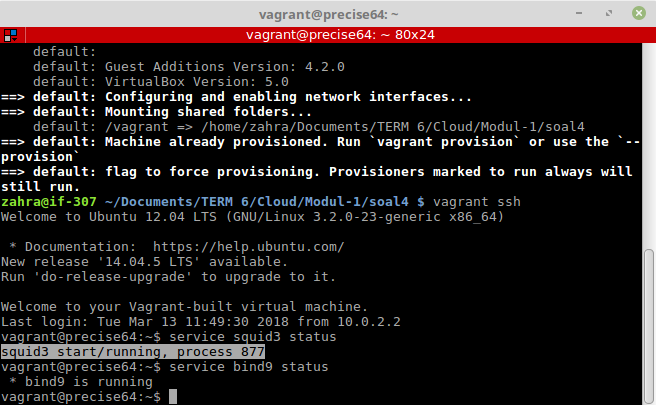
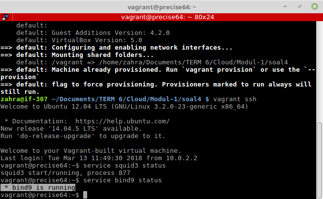

## Dokumentasi Soal 4
# Instalasi Squid Proxy dan Bind9 dengan Provision

## Soal

```
Buat vagrant virtualbox dan lakukan provisioning install:

    * Squid proxy
    * Bind9
```

## Penyelesaian
### **Langkah 1** - Membuat Vagrant Virtual Box serta Konfigurasinya
Membuat sebuah vagrant virtualbox dengan langkah-langkah dan konfigurasi yang telah diajarkan pada [Modul 1 Komputasi Awan 2018](https://github.com/fathoniadi/cloud-2018/tree/master/vagrant "Modul 1 Komputasi Awan 2018")

### **Langkah 2** - Membuat Provision Script
1. Membuat bash script dengan nama **installation.sh** pada folder yang sama dengan **Vagrantfile**

    ```bash
    nano installation.sh
    ```
2. Menuliskan script berikut

    ```bash
    #!/usr/bin/env bash
    apt-get update
    apt-get install -y squid3
    apt-get install -y bind9
    ```

### **Langkah 3** - Mengedit Vagrantfile
1. Edit file **Vagrantfile**

    ```bash
    nano Vagrantfile
    ```
2. Menambahkan baris berikut 

    ```bash
        config.vm.provision "shell", path: "installation.sh"
    ```
    diatas ```end``` paling terakhir

3. Simpan **Vagrantfile**

### **Langkah 4** - Reload Box Vagrant untuk menjalankan provision
1. Jika box vagrant telah diaktifkan, jalankan command 

    ```bash
    vagrant reload --provision
    ```
    Jika box vagrant belum diaktifkan, maka jalankan command 

    ```bash
    vagrant up --provision
    ```
Maka, vagrant akan melakukan instalasi sesuai script pada **installation.sh**

### **Langkah 4** - Service Testing
1. Lakukan ssh ke virtualbox vagrant dengan menjalankan command di dalam folder box vagrant.

    ```bash
    vagrant ssh
    ```
2. Jalankan **service squid3 status** untuk melihat status service **Squid Proxy**.



3. Jalankan **service bind9 status** untuk melihat status service **Bind9**.




## Script

[Vagrant dengan Squid Proxy dan Bind9](https://github.com/nahdazahra/cloud2018/tree/master/Vagrant/vagrant_bind9_squid3)